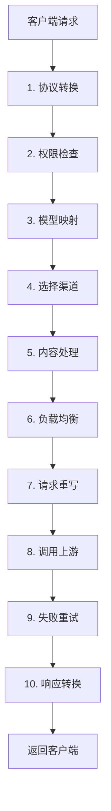

# 请求处理流程指南

本文介绍一个请求进入 AxonHub 后，大致会经过哪些步骤。它的目标是帮助你建立一个简单、准确的心智模型。

## 一句话总结

AxonHub 会先把请求转换成统一格式，再根据配置选择渠道，最后把结果转换回客户端期望的格式。

## 核心概念：三层模型设置

AxonHub 中有三个地方会影响模型名称：

| 层级    | 配置位置        | 作用                   | 简单理解     |
| ------- | --------------- | ---------------------- | ------------ |
| 第 1 层 | API Key Profile | 改写客户端请求的模型名 | 改"想要什么" |
| 第 2 层 | 模型关联        | 选择处理请求的渠道     | 选"去哪处理" |
| 第 3 层 | 渠道配置        | 改写发给上游的模型名   | 改"怎么称呼" |

**处理顺序**：API Key Profile 改模型名 → 模型关联选渠道 → 渠道改模型名 → 发给上游

## 完整处理流程



如果把 Share / Use 方案也放进这条链路里，可以把“共享池排除自己”“先看自有渠道还是先看他人共享池”“soonest-refresh-first”理解为 **第 4 步“选择渠道”的细化**：它们发生在候选渠道已经找出来之后、进入现有负载均衡评分之前。当前这部分仍以 [共享/使用 MVP 指南](../guides/share-use-mvp.md#请求分发规则) 中定义的目标行为为准，不代表所有部署都已经完整启用。

## 各阶段说明

### 1. 协议转换

AxonHub 支持多种 API 格式（如 OpenAI、Anthropic、Gemini），会先把请求转换成统一的内部格式。

### 2. 权限检查

系统会先检查 API Key 和当前 Profile 的基本限制，例如：

- API Key 是否有效
- 是否超出额度
- 是否允许访问该模型

如果失败，请求会在这里直接返回错误。

### 3. 模型映射

这是第一层模型名称改写，由 API Key Profile 的模型映射决定。

例如：

```
客户端请求: gpt-4
    ↓
API Key Profile: gpt-4 → claude-3-opus
```

### 4. 选择渠道

系统会根据模型关联，找出哪些渠道可以处理当前请求。

这一步通常会结合：

- 模型关联规则
- API Key Profile 的渠道限制
- 渠道是否启用

如果按 Share / Use 目标方案继续细化，第 4 步还会继续做：

- 校验请求模型是否命中 `modelIDs`
- 应用 `private/shared` 可见性过滤
- 按 `useStrategy`（如 `own_only`、`own_first`、`shared_first`、`shared_only`）把候选渠道分桶

### 5. 内容处理

在发送给上游之前，系统还可能做一些内容处理，例如：

- 提示词注入
- 提示词保护

### 6. 负载均衡

如果有多个候选渠道，系统会决定先尝试哪个渠道。

在 Share / Use 场景里，进入这一步之前还会先经过两层前置排序：

- 策略优先顺序：例如 `own_first` 先排自有渠道，`shared_first` 先排他人共享池
- `soonest-refresh-first`：同一桶内，让 `nextRefreshAt` 更早的渠道排前

完成这两层前置排序后，系统才继续应用现有负载均衡策略。

常见影响因素包括：

- 渠道权重
- 历史状态
- 当前负载

### 7. 请求重写

在渠道层，系统可以进一步改写要发送给上游的模型名和请求参数。

### 8. 调用上游

系统把请求发送给选定的 AI 服务商。

### 9. 失败重试

如果调用失败，系统可能会重试，或者切换到下一个候选渠道。

### 10. 响应转换

系统把上游返回的结果转换回客户端期望的格式，并记录请求结果。

## 什么时候看哪篇文档

| 如果你的问题是                                   | 优先看             |
| ------------------------------------------------ | ------------------ |
| 想设定 `/use` 的模型白名单和共享分发策略         | 共享/使用 MVP 指南 |
| 想决定请求走哪个渠道                             | 模型关联           |
| 想了解共享渠道、自有优先和刷新窗口在链路中的位置 | 共享/使用 MVP 指南 |
| 想改发给上游的模型名或请求参数                   | 渠道配置           |

## 相关文档

- [渠道管理指南](../guides/channel-management.md)
- [模型管理指南](../guides/model-management.md)
- [共享/使用 MVP 指南](../guides/share-use-mvp.md)
